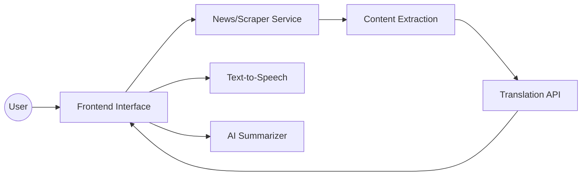
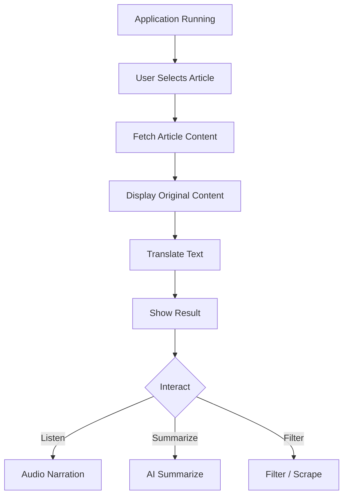

# 🌍 LingualNews

**LingualNews** is a dynamic web application built with React and Vite that provides users with global news, seamlessly translated and narrated in their preferred languages. It integrates advanced AI and translation APIs to break down language barriers in accessing global information.


---

## ✨ Features

- **🌐 Global News Retrieval**: Instantly fetch top news articles dynamically. Browse news globally or filter by continent.
- **🗣️ Smart Translation**: Translate text using native translation capabilities powered by **Lingo.dev API** and **Google Gemini** into the user's preferred language.
- **🔊 Text-to-Speech (TTS)**: Listen to translations and articles with high-quality, natural-sounding voice readouts.
- **🧠 AI Summarization**: Get concise insights on news content using **Google Gemini** for intelligent processing.
- **📄 Article Scraping**: Input any news URL or raw text to extract, summarize, and translate seamlessly.
- **🎨 Sleek UI/UX**: Offers a highly responsive, modern "retro-style" dark theme for comfortable reading and intuitive navigation.

---

## 🛠️ Installation

### Prerequisites
1. **Node.js** (v18+ recommended) installed.
2. API Keys for **Google Gemini** and **Lingo.dev**.

### Steps
1. **Clone the repository**:
   ```bash
   git clone https://github.com/your-username/lingualNews.git
   cd lingualNews
   ```

2. **Install dependencies**:
   ```bash
   npm install
   ```

3. **Configure Environment Variables**:
   Create a `.env` file in the root directory and add your required API keys:
   ```env
   VITE_GEMINI_API_KEY=your_gemini_api_key_here
   VITE_LINGO_API_KEY=your_lingodev_api_key_here
   ```

4. **Run the Application**:
   ```bash
   npm run dev
   ```
   *Open your browser to the local address provided by Vite.*

---

## 📖 Usage

1. **Start LingualNews**: The app will launch your web browser and load the global news homepage.
2. **Select Content**:
   - Filter news by continent or scroll through top daily headlines.
   - Click on an article card to enter the dedicated reading view.
3. **View Results**: The detailed news page will load the full context and original text.
4. **Interact**:
   - 🌎 **Translate**: Change the language dropdown to auto-translate the article.
   - 🔊 **Read Aloud**: Click the Text-to-Speech buttons to listen to the news.
   - 🔗 **Scrape URL**: Go to custom input to scrape external URLs and extract their content.
5. **Settings Options**: Adjust language and continent filters directly from the responsive navigation bar.

---

## 🏛️ System Architecture

### 📊 Block Diagram

A high-level view of the system components.



---

### 🔄 Workflow

The simple process from fetching news to translating and listening.



---

## 💻 Tech Stack

| Component | Technology | Description |
| :--- | :--- | :--- |
| **Framework** | **React** | Core frontend UI logic and component rendering. |
| **Tooling** | **Vite** | Modern, fast development build engine and server. |
| **Routing** | **React Router** | Seamless Single-Page App (SPA) navigation. |
| **HTTP** | **Axios** | Robust Promise-based API handling. |
| **Translation** | **Lingo.dev API** | Direct REST integrations for high-speed translations. |
| **AI Engine** | **Google Gemini** | Advanced content extraction and intelligent summarization. |
| **TTS Engine** | **Web TTS APIs** | Integrated dynamic speech synthesis. |
| **Styling** | **Vanilla CSS** | Global dark-theme system overriding standard browser styles. |

---

## 📂 Project Structure

```bash
lingualNews/
├── src/
│   ├── components/      # Reusable UI components
│   │   ├── Navbar.jsx   # Top navigation and filters
│   │   ├── NewsCard.jsx # Article representation block
│   │   └── Footer.jsx   # Page footer elements
│   ├── pages/           # Core application views
│   │   ├── HomePage.jsx # Global news feed
│   │   └── ArticlePage.jsx # Translation and reading view
│   ├── services/        # Backend logic & API wrappers
│   │   ├── aiService.js
│   │   ├── newsService.js
│   │   ├── scraperService.js
│   │   ├── translationService.js
│   │   └── ttsService.js
│   ├── styles/          # Styling and theme definitions
│   │   └── index.css    # Global stylesheet
│   ├── App.jsx          # Main application logic
│   └── main.jsx         # Application entry
├── public/              # Static assets
├── index.html           # Main HTML template
├── package.json         # Dependencies and scripts
├── vite.config.js       # Vite configuration
└── .env                 # API Credentials (ignored)
```

---

## 🔗 Links

Demo video: Coming Soon!

---

## 📄 License

Distributed under the MIT License. See `LICENSE` for more information.
